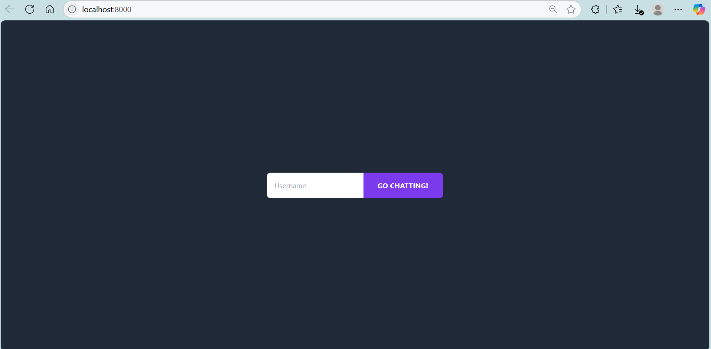
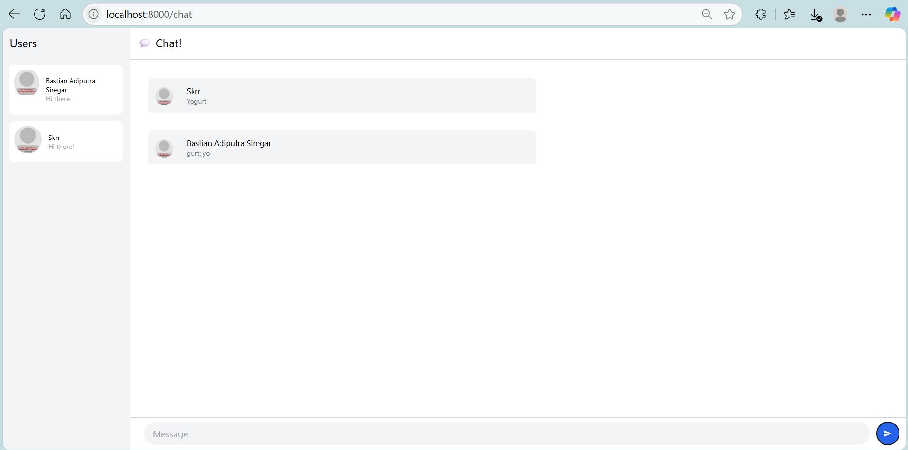
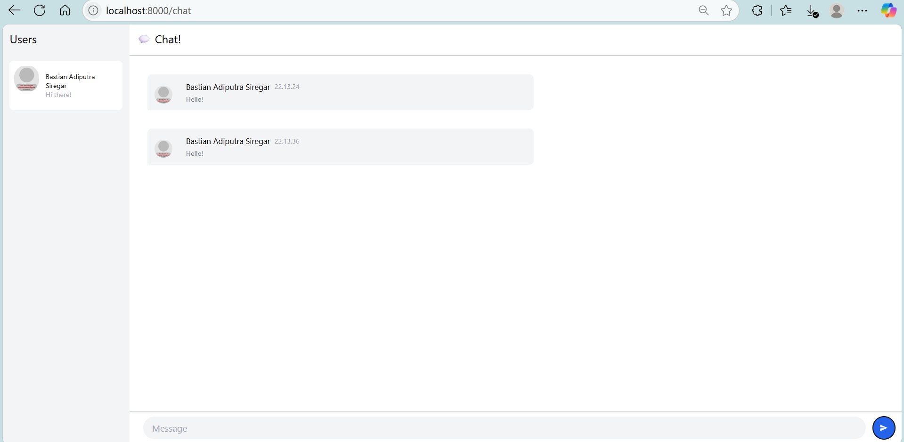

## Original code

pada aplikasi ini, pengguna diminta untuk memasukkan username sebelum bergabung ke chat room. Setelah bergabung, interface chat menampilkan daftar pengguna online di sebelah kiri dan area pesan di bagian tengah. 

## Be Creative

Pada commit ini, saya menambahkan fitur time yang terlihat keitka user mengirim chat ke chatroom